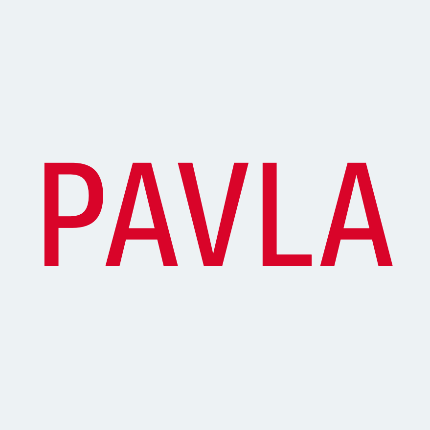

**Your sustainable and eco-friendly guide.**

Pavla is a system, a platform and a way to move more people 
in a way that is clean, efficient and long term sustainable.

## Challenges that Pavla addresses

1. Support traveling in more sustainable way.
2. Lower the amount of traffic
3. Optimize the way how we travel.

## Authors

- [Oto Brglez](https://github.com/otobrglez)
